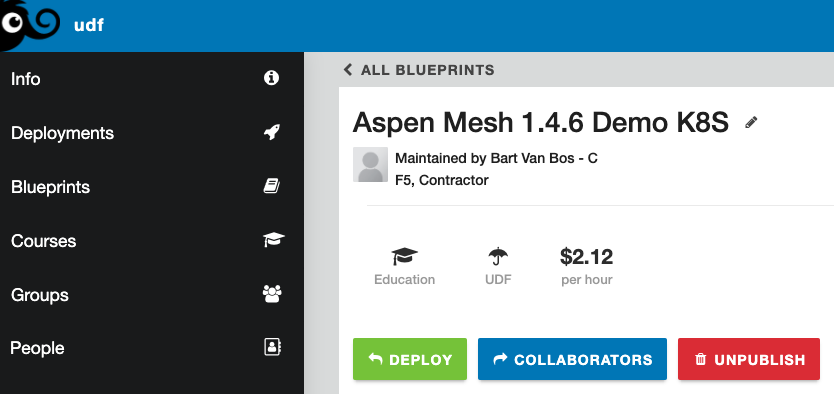

# Aspen Mesh UDF Demo

## Introduction

This repository contains the documentation on the Aspen Mesh Blueprint on the F5 UDF (Universal Demo Framework) platform.

Location of the Blueprint [here](https://udf.f5.com/b/7bce8f87-6b97-46b4-a2f2-d398acb4e6fa).

 

The blueprint contains of the following systems:

| Name | IP Address | Access Methods |
|---|---|---|
| **Ubuntu Jumphost** | 10.1.1.4 | SSH/RDP/HTTPS |
| **Kubernetes Master** | 10.1.1.5 | SSH |
| **Kubernetes Node1** | 10.1.1.6 | SSH |
| **Kubernetes Node2** | 10.1.1.7 | SSH |
| **Kubernetes Node3** | 10.1.1.8 | SSH |

Credentials are documented inside the UDF Summary page.

On the Jumphost, the following extra access methods (HTTPS based) are available:

 - **RancherDashboard:** k8s rancher dashboard for k8s resource visibility
 - **AspenDashboard:** the aspenmesh dashboard gui
 - **AspenMetrics:** the aspenmesh metrics collector (prometheus)

## Installation Details

### Repositories

The following github repositories were used to install the environment:

 - https://github.com/CloudDevOpsEMEA/udf-aspenmesh-docs - this documentation
 - https://github.com/CloudDevOpsEMEA/udf-aspenmesh-kubespray - kubespray config used to spinup k8s cluster
 - https://github.com/CloudDevOpsEMEA/aspenmesh-1.4.6-am8 - aspenmesh deliverables, with changes and extras
 - https://github.com/CloudDevOpsEMEA/online-boutique-microservices-demo - grpc based microservice demo
 - https://github.com/CloudDevOpsEMEA/digibank-microservice-demo - http based microservice demo

### Networking

Nginx+ is used on the jumphost to give access to the cluster:

 - TCP loadbalancing for the control plain components:
   - rancher dashboard
   - aspenmesh dashboard
   - aspenmesh metrics collector
   - jaeger (not enabled in the cluster)
   - prometheus (for vanilla prometheus, not enabled in the cluster)
 - HTTP loadbalancing is used for cluster workloads
   - load balancing over 10.1.1.5, 10.1.1.6, 10.1.1.7, 10.1.1.8
   - istio ingress gateway is exposed type nodeport (TCP/31390)
   - bookinfo, digibank and online boutique are accessible this way

Because we use the Istio Ingress Controller exposed as service type **nodeport**, to expose multiple application, the HTTP host header is used/necessary to route traffic to the correct application inside the cluster. In order for this to work correctly, a bind9 DNS server has been installed on the jumphost. A browser will not add a host header in case DNS resolving is done throughout a local */etc/hosts* file.

### Persistency

OpenEBS is used to provide dynamic persistent volumes, needed by AspenMesh and the storage requirements of the demo application digibank (mongo) and online boutique (redis)

## Improvements and change requests

As there are many moving parts and the setup is quite big, there is a lot of room for improvements. In order to be able to track bugs and improvement requests, the following trello kanban dashboard has been created. Please use this to track your requests.

https://trello.com/b/tWxiwNVd/udp-aspenmesh-demo

All contributions in terms of advice, code changes (commits and pull requests) or feature requests is higly appreciated.
